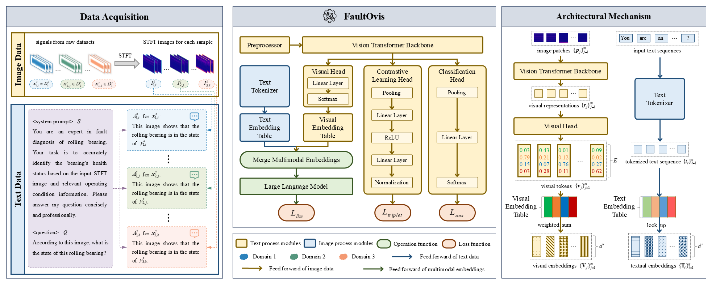
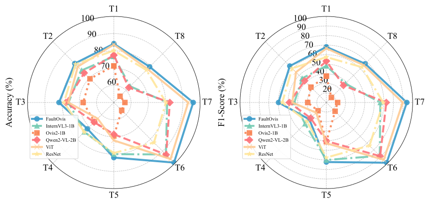

# FaultOvis: A Domain-Generalized Vision-Language Model for Rolling Bearing Fault Diagnosis

[← Back to Homepage](../README.md)

## Overview

FaultOvis is a domain-generalized vision-language framework for cross-domain rolling bearing fault diagnosis under unseen working conditions.

It converts raw vibration signals into short-time Fourier transform (STFT) images and adapts a vision-language model for multimodal industrial fault diagnosis. Unlike purely generative VLM fine-tuning methods that may only learn diagnostic answer templates, FaultOvis introduces explicit visual-side supervision to improve fault-discriminative and domain-invariant representation learning.

This work represents my exploration of adapting multimodal foundation models to industrial sensor-image reasoning under domain shifts.

## Motivation

Rolling bearings are widely used in rotating machinery, and their health condition directly affects industrial safety, reliability, and maintenance cost. Although deep learning methods have achieved strong results in closed-set fault diagnosis, their performance often drops when the training and testing data come from different working conditions.

Vision-language models offer new opportunities for interactive and explainable industrial diagnosis, because they can combine visual sensor representations with natural-language diagnostic prompts. However, directly adapting general-purpose VLMs to STFT images is not sufficient. Since these models are pretrained mainly on natural images and text, they may struggle to capture fine-grained time-frequency fault patterns in industrial signals.

A key issue is that standard visual instruction tuning mainly optimizes textual generation. The model may learn to produce diagnostic answer formats without learning robust visual representations that generalize across domains.

FaultOvis aims to address this problem by adding explicit visual-side supervision to the VLM adaptation process. The goal is to make the visual branch learn representations that are both fault-discriminative and more robust to unseen working conditions.

## Method

FaultOvis is built on Ovis2-1B and uses STFT images as visual representations of vibration signals. Each input sample is formulated as a multimodal diagnostic tuple containing an STFT image, a system prompt, a diagnostic question, and the corresponding fault label response.

The framework contains three main components:

- A vision-language backbone for multimodal diagnostic response generation
- An auxiliary classification head for explicit fault-category supervision
- A contrastive learning head for cross-domain feature alignment

The overall training objective combines three losses:

- Causal language modeling loss for diagnostic response generation
- Auxiliary classification loss for category-level visual discrimination
- Triplet contrastive loss for domain-invariant representation learning

### Visual-side Supervision

FaultOvis introduces two task-specific heads on the visual branch.

The auxiliary classification head supervises pooled visual features with fault-category labels. This encourages the visual representation to contain fault-discriminative information instead of relying only on the language modeling objective.

The contrastive learning head projects visual features into a metric space and applies hardest triplet mining. Same-class samples from different domains are pulled closer, while different-class samples, especially those from the same domain, are pushed apart. This design encourages the model to learn domain-invariant fault representations.

### Two-stage Training Strategy

FaultOvis uses a two-stage optimization strategy.

In the first stage, the model is trained for diagnostic format adaptation. The vision encoder is frozen, and language-side LoRA tuning is used to help the model generate fault diagnosis responses in the expected format.

In the second stage, FaultOvis activates visual-side discriminative reinforcement. The visual branch is further adapted with the auxiliary classification head and contrastive learning head, while the model continues to preserve its multimodal diagnostic response ability.

This staged design decouples diagnostic answer-format learning from visual representation reinforcement, making the optimization process more stable.

## Key Contributions

- A domain-generalized vision-language framework for cross-domain rolling bearing fault diagnosis
- An STFT-image-based multimodal diagnostic formulation combining industrial sensor images and natural-language prompts
- Explicit visual-side supervision through an auxiliary classification head and a contrastive learning head
- A two-stage training strategy that separates diagnostic format adaptation from visual discriminative reinforcement
- Leave-one-domain-out evaluation on CWRU and Ottawa bearing datasets under unseen working conditions
- Ablation studies validating the roles of auxiliary classification, contrastive alignment, visual-module optimization, and loss-weight settings

## Key Results

FaultOvis is evaluated on two rolling bearing fault diagnosis benchmarks: CWRU and Ottawa. Both datasets are organized into four domains corresponding to different operating conditions, and the experiments follow a leave-one-domain-out domain generalization protocol.

Across eight cross-domain tasks, FaultOvis achieves the best overall performance on most unseen target domains compared with fine-tuned VLM baselines and conventional image classifiers.

Representative results include:

- Best or highly competitive performance on most CWRU tasks
- Strong performance on all Ottawa tasks
- Clear improvement over the base Ovis2-1B model
- More stable cross-domain generalization than purely generative VLM fine-tuning

On the Ottawa benchmark, FaultOvis achieves particularly strong results:

- T5: **82.00% Acc. / 72.22% F1**
- T6: **99.33% Acc. / 99.00% F1**
- T7: **96.00% Acc. / 93.91% F1**
- T8: **79.33% Acc. / 67.27% F1**

Compared with the base Ovis2-1B, FaultOvis substantially improves the F1-score on several difficult domain-shift tasks, showing that explicit visual-side supervision is important for VLM-based industrial diagnosis.

## Ablation Study

FaultOvis includes four ablation studies to analyze the contribution of each design choice.

### Visual-side Heads

The first ablation compares four variants:

- Baseline: language-side tuning only
- M1: with auxiliary classification head
- M2: with contrastive learning head
- FaultOvis: with both auxiliary and contrastive heads

The results show that the auxiliary head improves fault-category separability, while the contrastive head strengthens cross-domain feature alignment. The full model achieves the best overall performance, indicating that these two objectives are complementary.

### Visual-module Optimization

The second ablation studies how different visual modules should be optimized under the auxiliary-head setting.

The results show that fully fine-tuning the visual head and visual embedding table leads to better performance than freezing or only partially adapting them. This suggests that the visual-to-language alignment modules in Ovis2 are sensitive to the distribution shift from natural images to industrial STFT images.

### Auxiliary Loss Weight

The third ablation studies the effect of the auxiliary classification loss weight. Small auxiliary-loss weights provide insufficient category-level supervision, while overly large weights may harm cross-domain generalization. A moderate setting provides a better trade-off between generative learning and visual discrimination.

### Triplet Loss Weight

The fourth ablation studies the effect of the triplet contrastive loss weight. Stronger contrastive supervision improves domain robustness by clustering same-class cross-domain samples and suppressing domain-specific variations.

Overall, the ablation studies confirm that FaultOvis benefits from both category-discriminative and domain-invariant visual representation learning.

## Notes

FaultOvis is not intended to be only a conventional bearing fault classifier. Its main purpose is to investigate how vision-language models can be adapted to domain-shifted industrial signal analysis.

The key finding is that purely generative VLM adaptation is insufficient for robust cross-domain fault diagnosis. To use VLMs effectively in industrial diagnosis, the visual representation space should be explicitly supervised and aligned with fault-discriminative, domain-invariant objectives.

This project serves as an intermediate step in my research trajectory from signal-image-based VLM adaptation to more general physical-signal foundation models.

## Paper and Code

- Paper: Coming soon
- Code: Coming soon
- Status: Manuscript under review